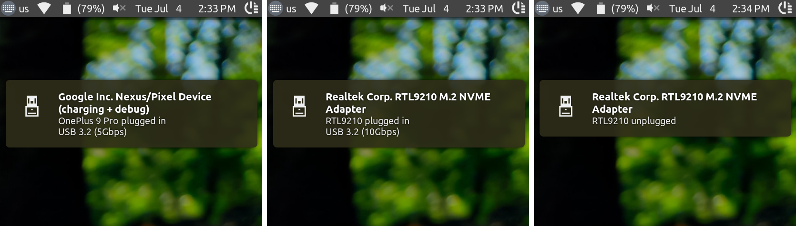

# udev-notify
* Show notifications when any USB device is plugged/unplugged

## Screenshots:


## Dependencies:
```
usbutils
libnotify
sox
espeak-ng
sed
coreutils
gawk
grep
util-linux
bash
```
## To get started:
* **Download the latest revision**
```
git clone https://github.com/arter97/udev-notify.git
```
* **Switch to tool's directory**
```
cd udev-notify
```
* **Install udev-notify**
```
make install
```
